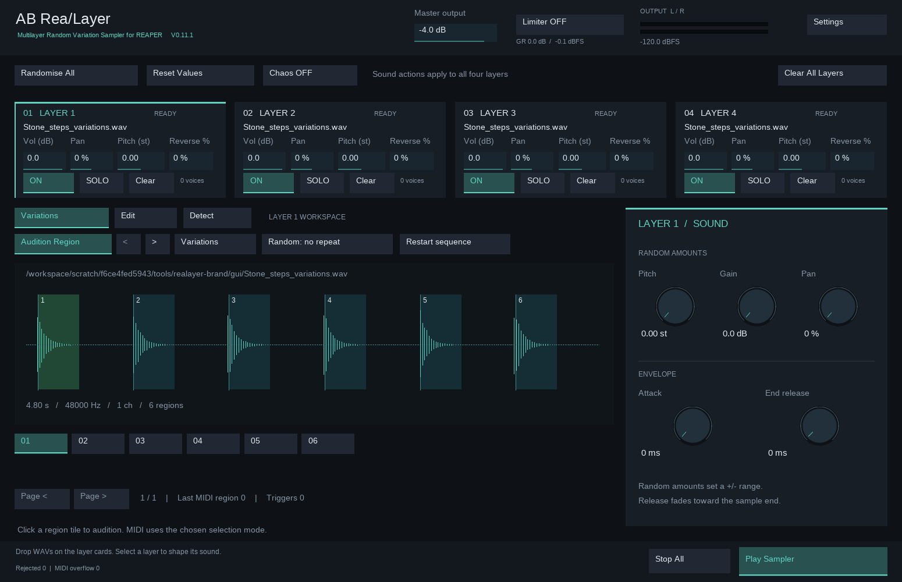

# AB ReaLayer

**Turn recordings into variations.** A multilayer random variation sampler for REAPER, designed for game audio and sound design.



- Four drag-and-drop WAV layers with automatic region detection.
- Independent volume, pan, pitch, reverse chance and envelopes.
- Randomise All, Reset Values and limiter-protected Chaos mode.
- MIDI triggering or one-click Play Sampler.
- Editable regions and external WAV recall.

## Install through ReaPack

Import this repository URL in **Extensions → ReaPack → Import repositories**:

```text
https://raw.githubusercontent.com/RoadToOmega/AB-ReaLayer/main/index.xml
```

Only the JSFX is installed; no companion script, Python or Ruby is needed to use it. Source WAVs are not bundled.

## Existing installations and the 0.11.3 filename change

Version 0.11.3 uses `AB_ReaSampler.jsfx` and appears as a new package identity in ReaPack. Synchronize the repository, then select this filename in Browse packages and install it for new instances. Keep the old installed file if saved projects reference it. If ReaPack offers to uninstall an obsolete package, retain it until those projects have been migrated. ReaPack installs into its own repository/category directory and does not automatically migrate those project references. Use the ReaPack-managed copy for new instances. Keep the repository name and Instruments/AB_ReaSampler.jsfx path stable after publication.

## Requirements and limits

A 64-bit REAPER installation with enough free memory is recommended. Each instance preallocates about 770 MiB plus host overhead. Each layer accepts up to 96 MiB of decoded PCM, approximately 65.5 seconds of 96 kHz stereo audio. The limiter adds approximately 2 ms of fixed delay, including when OFF. It limits sample peaks, not true peaks. WAV files remain external.

## Documentation

- [User guide](docs/USER-GUIDE.md)
- [Repository setup and updates](SETUP.md)
- [Architecture](docs/ARCHITECTURE.md)
- [Workstation checks](docs/ACCEPTANCE.md)

## Development

Edit src/ and release.json, then run:

```sh
python3 src/build.py
python3 tools/check_package.py
```

Commit the generated Instruments/AB_ReaSampler.jsfx with your source changes. GitHub Actions checks the build and updates index.xml. Future plugin releases must increment the version in release.json.

## Licence

Copyright © 2026 Alec Bathman.

AB ReaLayer is free to use for personal and commercial audio work, including games, films, music and client projects.

You may inspect, modify and redistribute the plugin free of charge, provided you retain the copyright notice and licence terms and clearly identify any modifications.

Selling the plugin, selling modified versions, or including its code in paid software, paid bundles or paid download subscriptions requires prior written permission from Alec Bathman.

Audio created using AB ReaLayer is yours to use and sell, subject to the licences of your source samples. No royalties or attribution to AB ReaLayer are required.

AB ReaLayer is source-available software released under the **AB ReaLayer Licence — Free Use, No Resale**.
